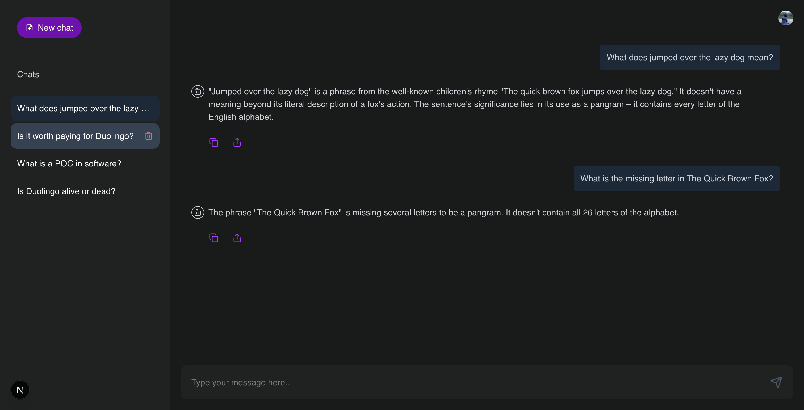
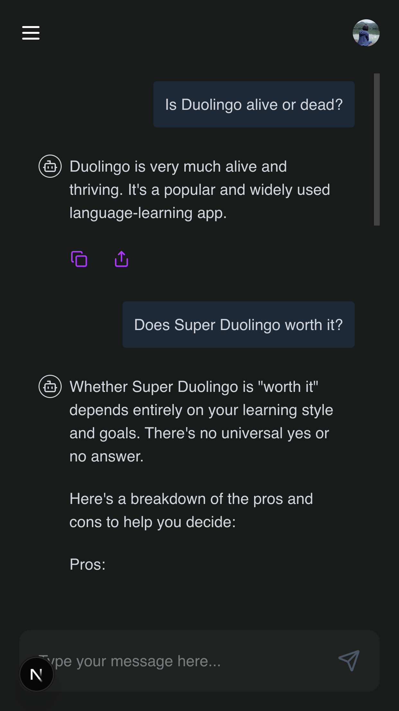

# AI Chatbot Application

## Project Introduction
This is an AI chatbot application developed using Next.js. Its main goal is to provide an interactive chat interface that allows users to converse with AI.

## Key Features
*   **Real-time Chat Functionality**: Supports real-time message exchange between users and AI.
*   **User Authentication**: Includes registration, login, and logout features to ensure user data security.
*   **Chat History**: Ability to save and manage users' chat conversation history.
*   **Responsive Design**: Ensures the application provides a good user experience on different devices.

## Screenshots

| Desktop View | Mobile View |
| :----------: | :---------: |
|  |  |

## Technology Stack
*   **Frontend**: Next.js, React, TypeScript, Tailwind CSS, Ant Design, Lucide React
*   **State Management**: Zustand
*   **AI Integration**: Vercel AI SDK, GeminiAI
*   **User Management**: Clerk
*   **Database**: MongoDB Atlas + Mongoose (ODM)
*   **Backend**: Next.js API Routes (for handling AI interactions)

## User Stories
*   As a **new user**, I want to be able to register an account and log in, so that I can start using the chatbot.
*   As a **logged-in user**, I want to be able to send messages to the AI and receive instant replies, so that I can have a conversation.
*   As a **logged-in user**, I want to be able to view my past chat history, so that I can review previous conversations.
*   As a **logged-in user**, I want to be able to log out of my account, to protect my privacy.

## Environment Variables
To run this project, you will need to create a `.env` file in the root directory and add the following environment variables:

```
NEXT_PUBLIC_CLERK_PUBLISHABLE_KEY=your_clerk_publishable_key
CLERK_SECRET_KEY=your_clerk_secret_key

NEXT_PUBLIC_CLERK_SIGN_UP_URL=/sign-up
NEXT_PUBLIC_CLERK_SIGN_IN_URL=/sign-in

# Cluster0-gpt (Example for MongoDB Atlas)
# MONGODB_URI=mongodb+srv://penny:<db_password>@cluster0-gpt.qa4voio.mongodb.net/<db_name>

# Local MongoDB instance
MONGODB_URI=mongodb://127.0.0.1:27017/<db_name>

# OpenAI API Key
OPEN_AI_API_KEY=your_openai_api_key

# Google gemini API Key
GOOGLE_GENERATIVE_AI_API_KEY=your_gemini_api_key
```
